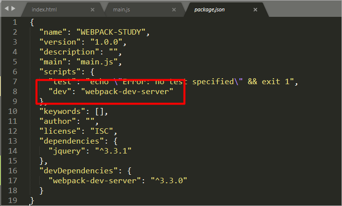
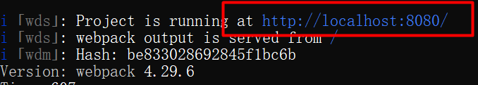
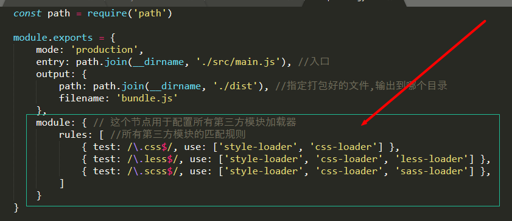
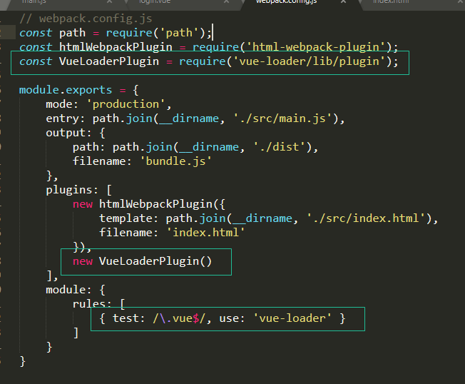

## Vue

* * *

## 使用

1. 引入vue.js插件
2. 编写html界面
3. 创建Vue对象

```javascript
//该代码在script标签内
new Vue({});
```

4. 绑定vue对象所能控制的区域

```javascript
new Vue({
    el: 'selector'
});
```

5. 在vue对象内添加页面所需的数据,事件...

```javascript
new Vue({
    el: 'selector',
    data: {},
    ...
});
```

## 插值语法(interpolate)

- 动态绑定元素的内容

```html
<any>{{模型变量}}</any>
<any>{{各种有返回值的js表达式}}</any>
eg:
<div id="app">
    <h1>用户名:{{name}}</h1>
    <h1>积分:{{score}}</h1>
    <h1>性别:{{sex==1?'男':'女'}}</h1>
    <h1>下单时间:{{new Date(orderTime).toLocaleString()}}</h1>
    <h1>星期{{week[0]}}</h1>
</div>
<script>
    new Vue({
        el: '#app',
        data: {
            name: 'tom',
            score: 2000,
            sex: 1,
            orderTime: 124556545654,
            week: ['日', '一', '二', '三']
        }
    });
</script>
<!--输出结果:
用户名:tom
积分:2000
性别:男
下单时间:1973/12/12 下午11:02:25
星期日
-->
```

- html

```html
<div id="app">
    <div v-html="message"></div>
</div>

<script>
    new Vue({
        el: '#app',
        data: {
            message: '<h1>holloworld</h1>'
        }
    })
</script>
```

- 属性

```html
<style>
    .class1 {
        background: #444;
        color: #eee;
    }
</style>


<div id="app">
    <label for="r1">修改颜色</label><input type="checkbox" v-model="use" id="r1">
    <br><br>
    <div v-bind:class="{'class1': use}">
        v-bind:class 指令
    </div>
</div>

<script>
    new Vue({
        el: '#app',
        data: {
            use: false
        }
    });
</script>
```

- 表达式

```html
<div id="app">
    {{5+5}}<br> {{ ok ? 'YES' : 'NO' }}<br> {{ message.split('').reverse().join('') }}
    <div v-bind:id="'list-' + id">hello</div>
</div>

<script>
    new Vue({
        el: '#app',
        data: {
            ok: true,
            message: 'RUNOOB',
            id: 1
        }
    })
</script>
```

- 指令

```html
<div id="app">
    <p v-if="seen">现在你看到我了</p>
</div>

<script>
    new Vue({
        el: '#app',
        data: {
            seen: true
        }
    })
</script>
```

- 参数

```html
<div id="app">
    <pre><a v-bind:href="url">百度</a></pre>
</div>

<script>
    new Vue({
        el: '#app',
        data: {
            url: 'http://www.baidu.com'
        }
    })
</script>
```

- 缩写

```html
<!--1.v-bind-->
<!-- 完整语法 -->
<a v-bind:href="url"></a>
<!-- 缩写 -->
<a :href="url"></a>

<!--2.v-on-->
<!-- 完整语法 -->
<a v-on:click="doSomething"></a>
<!-- 缩写 -->
<a @click="doSomething"></a>
```

## v-for

```html
<div id="app">
    <ul>
        <li v-for="ele of tasks">{{ele}}</li>
    </ul>
</div>
<script>
    new Vue({
        el: '#app',
        data: {
            tasks: ["吃饭", "睡觉", "打游戏"]
        }
    });
</script>
```

## 双向绑定

    v-model:value = "kwords"

## watch

```javascript
new Vue({
    el: '#app',
    data: {},
    watch: {
        keyWorld() {
            // methods中的方法调用
        }
    }
});
```

## 定义自定义指令

```javascript
Vue.directive("指令名", { //起名时不能带v-
    /*回调函数,当拥有v-focus的元素挂载到页面
    上之后,自动执行*/
    inserted(ele) { //ele指有v-focus的当前的dom元素
        ele.focus()
    },
    bind: function() {
        //当指令绑定到元素上的时候,会立即执行这个bind函数,只执行一次
    },
    updated: function() {
        //当VNode更新的时候,会执行updated,可能会触发多次
    }
})

/******************eg*******************/
Vue.directive('color', {
    bind(el) {
        el.style.color = 'red';
    }
});

v - color = "'blue'"

Vue.directive('color', {
    bind(el, binding) {
        // el.style.color = 'red';
        el.style.color = binding.value;
    }
});

//自定义私有属性
var vm = new Vue({
    el: '#app',
    directives: {
        'fontweight': {
            bind: function(el, binding) {}
        }
    }
})
```

## 定义过滤器

```html
<script>
    Vue.filter("过滤名", function(v) {
        //v:会自动接住变量传入的原始值
        return 新值;
    });
</script>

<!--eg-->
<div id="app">
    <h1>性别1:{{sex1 | sexConvert | sexIcon}}</h1>
</div>
<script>
    Vue.filter("sexConvert", function(value) {
        return value === 1 ? "男" : "女";
    });

    Vue.filter("sexIcon", function(value) {
        return value === "男" ? value + "♂" : value + "♀";
    });

    new Vue({
        el: '#app',
        data: {
            sex1: 0
        }
    });
</script>

<!-------------------------------------->

<h1>性别1:{{sex1 | sexConvert("en") | sexIcon}}</h1>

<script>
    /*带参构造器*/
    Vue.filter("sexConvert", function(value, lang) {
        if (lang === "en") {
            return value === 1 ? "female" : "male";
        } else {
            return value === 1 ? "男" : "女";
        }
    });
    Vue.filter("sexIcon", function(value) {
        return value === "男" || value === "female" ? value + "♂" : value + "♀";
    });
</script>
<script>
    扩展: es6新语法 "1".toString().padStart(2, '0')
</script>
```

## axios

## vue-resource

```html
<div id="app">
    <button @click="getInfo">get请求</button>
    <button @click="postInfo">post请求</button>
    <button @click="jsonpInfo">jsonp请求</button>
</div>
<script>
    new Vue({
        el: '#app',
        data: {},
        methods: {
            getInfo() {
                this.$http.get("http://www.baidu.com").then(function(res) {
                    console.log(res)
                });
            },
            postInfo() {
                /**
                 * 发起post请求 application/x-www-form-urlencoded
                 * 手动发起的 post 请求,默认没有表单格式,所以,有的服务器处理不了
                 * 通过 post 方法的第三个参数,{ emulateJSON:true } 设置 提交的内容为
                 * 普通的表单数据格式
                 */
                this.$http.post("http://www.baidu.com", {}, {
                    emulateJSON: true
                }).then(function(res) {
                    console.log(res)
                });
            },
            jsonpInfo() {
                /*发起jsonp请求*/
                this.$http.jsonp("http://www.baidu.com").then(res => {
                    console.log(res)
                })
            }
        }
    });
</script>
```

## Vue组件

```html
<div id="app">
    <my-container></my-container>
    <my-container></my-container>
    <my-container></my-container>
</div>
<div id="tplContainer">
    <div>
        <button @click="substract">-</button>
        <span>{{n}}</span>
        <button @click="add">+</button>
    </div>
</div>
<script>
    Vue.component("my-container", {
        template: "#tplContainer",
        data: function() {
            return {
                n: 1
            };
        },
        methods: {
            add() {
                this.n++;
            },
            substract() {
                this.n--;
            }
        }
    });

    new Vue({
        el: '#app',
        data: {}
    });
</script>
```

## 自定义修饰符

```javascript
@keyup.enter = "方法名"
@keyup.tab = "方法名"
@keyup.delete = "方法名"
@keyup.esc = "方法名"
@keyup.space = "方法名"
@keyup.up = "方法名"
@keyup.down = "方法名"
@keyup.left = "方法名"
@keyup.right = "方法名"

//自定义全局按钮修饰符
Vue.config.keycodes.f2 = 113
```

## Vue动画

```html
<style>
    .v-enter,
    .v-leave-to {
        opacity: 0;
        transform: translateX(150px);
    }

    .v-enter-active,
    .v-leave-avtive {
        transition: all 0.8s ease;
    }

    .my-enter,
    .my-leave-to {
        opacity: 0;
        transform: translateY(150px);
    }

    .my-enter-active,
    .my-leave-avtive {
        opacity: 1;
        transition: all 0.8s ease;
    }
</style>
<div id="app">
    <input type="button" value="toggle" @click="flag=!flag">
    <!-- 1.使用 transition 元素,把需要动画的元素包裹起来-->
    <!-- transition元素是Vue官方提供的-->
    <transition>
        <h3 v-if="flag">这是一个H3</h3>
    </transition>

    <input type="button" value="toggle" @click="flag2=!flag2">
    <!-- 1.使用 transition 元素,把需要动画的元素包裹起来-->
    <!-- transition元素是Vue官方提供的-->
    <transition name="my">
        <h3 v-if="flag2">这是一个H3</h3>
    </transition>
</div>
<script>
    new Vue({
        el: '#app',
        data: {
            flag: false,
            flag2: false
        }
    });
</script>

//使用animate设置动画
<div id="app">

    <input type="button" value='toggle' @click='flag=!flag'>
    <!--<transition enter-active-class="animated bounceIn" leave-avtive-class="animated bounceOut">
        <h3 v-if="flag">这是一个h3</h3>
    </transition>-->

    <!--<transition enter-active-class="bounceIn" leave-avtive-class="bounceOut" :duration="400">
        <h3 v-if="flag" class='animated'>这是一个h3</h3>
    </transition>-->

    <transition enter-active-class="bounceIn" leave-avtive-class="bounceOut" :duration="{enter:200,leave:200}">
        <h3 v-if="flag" class='animated'>这是一个h3</h3>
    </transition>
</div>
<script>
    new Vue({
        el: '#app',
        data: {
            flag: false
        }
    });
</script>

//动画三
<style>
    .ball {
        width: 15px;
        height: 15px;
        background-color: red;
        border-radius: 50%;
    }
</style>
<div id="app">
    <input type="button" value='快到碗里来' @click='flag=!flag'>
    <transition @before-enter='beforeEnter' @enter='enter' @after-enter='afterEnter'>
        <div v-if='flag' class="ball"></div>
    </transition>
</div>
<script>
    var vm = new Vue({
        el: '#app',
        data: {
            flag: false
        },
        methods: {
            beforeEnter(el) {
                el.style.transform = 'translate(0,0)';
            },
            enter(el, done) {
                el.offsetTop;
                el.style.transform = 'translate(150px,150px)';
                el.style.transition = 'all 1s ease';

                // 这里的done,其实就是afterEnter这个函数,也就是说:done 是afterEnter的引用
                done();
            },
            afterEnter() {
                this.flag = !this.flag;
            }
        }
    });
</script>

//列表动画
<style>
    li {
        border: 1px dashed #000;
        padding: 10px 20px;
        width: 100%;
        margin: 10px auto;
    }

    .v-enter,
    .v-leave-to {
        opacity: 0;
        transform: translateY(80px);
    }

    .v-enter-active,
    .v-leave-avtive {
        transition: all .6s ease;
    }

    li:hover {
        background-color: lightblue;
        transition: all .6s ease;
    }

    .v-move {
        transition: all .6s ease;
    }

    .v-leave-active {
        position: absolute;
    }
</style>
<div id="app">
    Id:<input type="text" v-model='id'> Name:
    <input type="text" v-model='name'>
    <input type="button" @click='add' value="add">
    <!-- <ul> -->
    <!-- 1.在实现列表过渡的时候,如果需要过渡的元素是通过 v-for 循环渲染出来的,不能使用 transition 包裹,需要使用 transition-group  -->
    <!-- 2.如果要为 v-for 循环创建的元素设置动画,必须为每一个元素设置 :key 属性  -->
    <!-- 3.给transition-group 添加 appear 属性,实现入场时候的效果 -->
    <!-- 4.通过为 transition-group 元素添加 tag 属性,指定该元素渲染为指定元素,如果不指定 tag 属性,默认渲染为 span 标签 -->
    <transition-group appear tag='ul'>
        <li v-for='(item,i) in list' :key='item.id' @click='del(i)'>{{item.id}} ---- {{item.name}}</li>
    </transition-group>
    <!-- </ul> -->
</div>
<script>
    new Vue({
        el: "#app",
        data: {
            id: '',
            name: '',
            list: [{
                    id: 1,
                    name: '赵高'
                },
                {
                    id: 2,
                    name: '秦桧'
                },
                {
                    id: 3,
                    name: '严嵩'
                },
                {
                    id: 4,
                    name: '魏忠贤'
                },
            ]
        },
        methods: {
            add() {
                this.list.push({
                    id: this.id,
                    name: this.name
                });
                this.id = ''
                this.name = ''
            },
            del(i) {
                this.list.splice(i, 1);
            }
        }
    });
</script>
```

## Vue组件

- vue创建组件方式1

```html
<div id="app">
    <my-com1></my-com1>
</div>
<script>
    var com1 = Vue.extend({
        template: '<h3>这是使用 Vue.extend 创建的组件</h3>'
    });

    Vue.component('myCom1', com1);

    new Vue({
        el: '#app',
        data: {},
        method: {}
    });
</script>
```

- vue 创建组件方式2

```html
<div id="app">
    <mycom2></mycom2>
</div>
<script>
    //注意:不论是那种方式创建出来的组件,组件的 template 属性指向模板内容,必须有且只能有唯一的一个根元素
    Vue.component('mycom2', {
        template: '<h3>这是直接使用 Vue.componet 创建出来的组件</h3>'
    });

    new Vue({
        el: '#app',
        data: {},
        method: {}
    });
</script>
```

- vue 创建组件方式3

```html
<div id="app">
    <mycom3></mycom3>
</div>

<template id="tmpl">
        <div>
            <h3>这是直接使用 tmplate 元素创建出来的组件</h3>
            <h4>好用,还可以</h4>
        </div>
    </template>
<script>
    //注意:不论是那种方式创建出来的组件,组件的 template 属性指向模板内容,必须有且只能有唯一的一个根元素
    Vue.component('mycom3', {
        template: '#tmpl'
    });

    new Vue({
        el: '#app',
        data: {},
        method: {}
    });
</script>
```

- 定义私有的组件

```javascript
new Vue({
    el: '#app',
    data: {},
    method: {},
    components: {
        login: {
            template: '<h1>这是私有的 login 组件</h1>'
        }
    }
});
```

## 组件中的 data 和 methods

```html
<div id="app">
    <mycom1></mycom1>
</div>
<script>
    // 1.组件可以有自己的 data 数据
    // 2.组件的 data 和实例的 data 有点不一样,实例中的 data 可以为一个对象,但是组件中的 data 必须是一个方法
    // 3.组件中的 data 除了必须为一个方法之外,这个方法内部,还必须返回一个对象才行
    // 4.组件中的 data 数据使用方式和实例中的 data 使用方式完全一样!!!
    Vue.component('mycom1', {
        template: '<h1>这是全局组件 --- {{msg}}</h1>',
        data: function() {
            return {
                msg: '这是组件中data定义的数据'
            }
        }
    });

    new Vue({
        el: '#app',
        data: {},
        method: {},
    });
</script>
```

## 组件切换

- 组件切换1

```html
<div id="app">
    <a href="" @click.prevent='flag=true'>登录</a>
    <a href="" @click.prevent='flag=false'>注册</a>
    <login v-if='flag'></login>
    <register v-else='flag'></register>
</div>
<script>
    Vue.component('login', {
        template: '<h1>登录页面</h1>',
        data() {
            return {};
        }
    });

    Vue.component('register', {
        template: '<h1>注册页面</h1>',
        data() {
            return {};
        }
    });

    new Vue({
        el: '#app',
        data: {
            flag: true
        },
        method: {},
    });
</script>
```

- 组件切换2

```html
<div id="app">
    <a href="" @click.prevent='comName="login"'>登录</a>
    <a href="" @click.prevent='comName="register"'>注册</a>
    <component :is='comName'></component>
</div>
<script>
    Vue.component('login', {
        template: '<h1>登录页面</h1>',
        data() {
            return {};
        }
    });

    Vue.component('register', {
        template: '<h1>注册页面</h1>',
        data() {
            return {};
        }
    });

    new Vue({
        el: '#app',
        data: {
            comName: 'login'
        },
        method: {},
    });
</script>
```

- 组件切换动画

```html
<style>
    .v-enter,
    .v-leave-to {
        opacity: 0;
        transform: translateX(150px);
    }

    .v-enter-active,
    .v-leave-active {
        transition: all .5s ease;
    }
</style>
<div id="app">
    <a href="" @click.prevent='comName="login"'>登录</a>
    <a href="" @click.prevent='comName="register"'>注册</a>
    <transition mode='out-in'>
        <component :is='comName'></component>
    </transition>
</div>
<script>
    Vue.component('login', {
        template: '<h1>登录页面</h1>',
        data() {
            return {};
        }
    });

    Vue.component('register', {
        template: '<h1>注册页面</h1>',
        data() {
            return {};
        }
    });

    new Vue({
        el: '#app',
        data: {
            comName: 'login'
        },
        method: {},
    });
</script>
```

## 组件传值

```html
<div id="app">
    <com1 :parentmsg="flag"></com1>
</div>
<script>
    new Vue({
        el: '#app',
        data: {
            flag: "true"
        },
        method: {},
        components: {
            data() {
                // data 上的数据是可读可写的
                return {
                    title: '123'
                }
            }
            com1: {
                template: '<h1>这是一个子组件 --- {{parentmsg}}</h1>',
                // 注意:组件居中的所有 props 中的数据,都是通过父组件给子组件的
                // 先把父组件的值传递过来,在 props 数组中定义一下,这样才能使用这个数据
                // props 中的数据都是只读的,无法重新赋值
                props: ['parentmsg']
            }
        }
    });
</script>
```

## 组件方法传递

```html
<div id="app">
    <com2 @func='show'></com2>
</div>
<template id="tmpl">
    	<div>
    		<h1>这是一个子组件</h1>
    		<button @click='myclick'>child</button>
    	</div>
    </template>
<script>
    var com2 = {
        template: '#tmpl',
        methods: {
            myclick() {
                // 触发父组件中的 methods
                this.$emit("func", 123)
            }
        }
    }

    Vue.component('com2', com2);

    new Vue({
        el: '#app',
        data: {
            flag: "true"
        },
        methods: {
            show(data) {
                console.log("parent --- " + data)
            }
        },
    });
</script>
```

## ref获取元素和组件

```html
<div id="app">
    <input type="button" value="获取元素" @click='getElement'>
    <h3 ref='myh3'>哈哈哈,今天天气太好了</h3>
</div>

<script>
    new Vue({
        el: '#app',
        data: {
            flag: "true"
        },
        methods: {
            getElement() {
                console.log(this.$refs.myh3.innerText)
            }
        },
    });
</script>
```

## 路由的基本使用

```html
<div id="app">
    <a href="#/login">login</a>
    <a href="#/register">register</a>
    <!-- view-router 提供的元素,专门用来占位 -->
    <router-view></router-view>
</div>
<script>
    // 组件的模板对象
    var login = {
        template: '<h1>login</h1>'
    }

    var register = {
        template: '<h1>register</h1>'
    }

    // 创建一个路由对象,当导入 vue-router 包之后,在 window 全局对象中就有了一个路由的构造函数,叫做 VueRouter
    // 在 new 路由对象的时候,可以为构造函数传递一个配置对象 
    var routerObj = new VueRouter({
        // route 表示 [路由匹配规则]
        routes: [ //路由匹配规则
            // 每个路由规则,都是一个对象,这个对象身上有两个必须的属性
            // 属性1 path 表示监听哪个路由连接地址
            // 属性2 component 表示如果路由是前面匹配到的path,则展示 component 属性对应的哪个组件 必须是组件的模板对象
            {
                path: '/login',
                component: login
            },
            {
                path: '/register',
                component: register
            }
        ]
    });

    new Vue({
        el: '#app',
        data: {
            flag: "true"
        },
        methods: {

        },
        router: routerObj //将路由规则对象注册到 vm 实例上
    });
</script>
```

## 路由传参

```html
<div id="app">
    <router-link to='/login?id=10'>登录</router-link>
    <router-link to='/register/12/tom'>注册</router-link>
    <router-view></router-view>
</div>
<script>
    var login = {
        template: '<h1>login --- {{$route.query.id}}</h1>',
        created() {
            console.log(this.$route.query.id);
        }
    }

    var register = {
        template: '<h1>register</h1>',
        created() {
            console.log(this.$route.params.id)
        }
    }

    var router = new VueRouter({
        routes: [{
                path: '/',
                redirect: '/login'
            },
            {
                path: '/login',
                component: login
            },
            {
                path: '/register/:id/:name',
                component: register
            }
        ]
    });

    new Vue({
        el: '#app',
        data: {
            flag: "true"
        },
        methods: {

        },
        router,
    });
</script>
```

## 路由嵌套

```html
<div id="app">
    <router-link to='/account'>account</router-link>
    <router-view></router-view>
</div>
<div id="tmpl">
    <template>
            <div>
                <h1>account</h1>
                <router-link to='/account/login'>登录</router-link>
                <router-link to='/account/register'>注册</router-link>
                <router-view></router-view>
            </div>
        </template>
</div>
<script>
    var login = {
        template: '<h1>login</h1>'
    }

    var register = {
        template: '<h1>register</h1>'
    }

    var account = {
        template: '#tmpl'
    }

    var router = new VueRouter({
        routes: [{
            path: '/account',
            component: account,
            children: [{
                    path: 'login',
                    component: login
                },
                {
                    path: 'register',
                    component: register
                }
            ]
        }]
    });

    new Vue({
        el: '#app',
        data: {
            flag: "true"
        },
        methods: {

        },
        router,
    });
</script>
```

## 命名视图实现金典布局

```html
<style>
    .header {
        background-color: orange;
        height: 80px;
    }

    h1 {
        margin: 0;
    }

    .container {
        display: flex;
        height: 600px;
    }

    .left {
        background-color: #f0f;
        flex: 2;
    }

    .main {
        background-color: #ff0;
        flex: 8;
    }
</style>
<div id="app">
    <router-view></router-view>
    <div class="container">
        <router-view name='left'></router-view>
        <router-view name='main'></router-view>
    </div>
</div>
<script>
    var header = {
        template: '<h1 class="header">header</h1>'
    }

    var leftBox = {
        template: '<h1 class="left">left侧边区域</h1>'
    }

    var mainBox = {
        template: '<h1 class="main">main主体区域</h1>'
    }

    var router = new VueRouter({
        routes: [{
            path: '/',
            components: {
                default: header,
                left: leftBox,
                main: mainBox
            }
        }, ]
    })

    new Vue({
        el: '#app',
        data: {
            flag: "true"
        },
        methods: {

        },
        router,
    });
</script>
```

## watch监听数据

```html
<div id="app">
    <input type="text" v-model='firstName'>+
    <input type="text" v-model='lastName'>=
    <input type="text" v-model='fullName'>
</div>
<script>
    new Vue({
        el: '#app',
        data: {
            firstName: '',
            lastName: '',
            fullName: ''
        },
        watch: {
            firstName: function(newVal) {
                this.fullName = newVal + '---' + this.lastName;
            },
            lastName: function(newValue) {
                this.fullName = this.firstName + '---' + newValue;
            }
        }
    });
</script>
```

## computed监听计算

```html
<div id="app">
    <input type="text" v-model='firstName'>+
    <input type="text" v-model='lastName'>=
    <input type="text" v-model='fullName'>
</div>
<script>
    new Vue({
        el: '#app',
        data: {
            firstName: '',
            lastName: ''
        },
        computed: {
            /*在 computed 中,可以定义一些属性,这些属性叫做[计算属性],
            计算属性的本质就是一个方法,只不过我们在使用这些计算属性的时候,
            是把他们的名称直接当做属性来使用,并不会把计算属性当做方法去调用*/

            /*注意: 计算属性在引用的时候,一定不要加()去调用,直接把他当做普通属性去使用就好了*/

            /*注意: 只要计算属性,这个function内部,所用到的任何data中的数据发生了变化,
            就会立即计算这个计算属性的值*/

            /*计算属性的求值结果,会被缓存起来,方便下次使用,如果,计算属性方法中的任何数据都没有发生变化
            ,则,不会重新对计算属性求值*/
            fullName: function() {
                return this.firstName + '---' + this.lastName;
            }
        }
    });
</script>
```

## nrm 的安装使用

作用: 提供了一些常用的npm包镜像地址,能够让我们快速的切换安装包的服务器地址;
什么是镜像:原来包刚一开始只存在于国外的npm服务器,但由于网络原因,经常访问不到,这时候.我们可以在国内创建一个和官网完全一样的npm服务器,只不过数据都是从人家那里拿过来的,除此之外,使用方式完全一样

1. 运行 `npm i nrm -g` 全局安装 `nrm`;
2. 使用 `nrm ls` 查看当前所有可用的镜像源地址及当前所使用的镜像源地址;
3. 使用 `nrm use npm` 或 `nrm use taobao` 切换不同的镜像地址;
   > 注意: nrm 只是单纯的提供了几个常用的下载包的url地址,并能够让我们在这几个地址之间很方便的进行切换,但是每次装包的时候,使用的装包工具都是 npm

## webpack

在网页中会引用哪些常见的静态资源

- JS
  - `.js, .jsx, .coffee, .ts(TypeScript类 C#语言)`
- CSS
  - `.css, .less, .sass, .scss`
- Images
  - `.jpg, .png, .gif, .bmp, .svg`
- 字体文件(fonts)
  - `.svg, .ttf, .eot, .woff, .woff2`
- 模板文件
  - `.ejs, jade, .vue(这是在webpack中定义组件的方式,推荐这么用)`

在指定文件夹中安装jquery

1. `npm init -y`
2. `npm i jquery -S`
3. 用webpack编译main.js `webpack ./src/main.js -o ./dist/bundle.js`

配置webpack

```javascript
const path = require('path')

module.exports = {
    mode: 'production',
    entry: path.join(__dirname, './src/main.js'), //入口
    output: {
        path: path.join(__dirname, './dist'), //指定打包好的文件,输出到哪个目录
        filename: 'bundle.js'
    }
}

// 当我们在控制台,直接输入webpack命令执行的时候,webpack做了以下几步:
// 1.首先,webpack发现,我们并没有通过命令的形式给他指定入口和出口
// 2.webpack就会去项目的根目录中查找一个叫做`webpack.config.js`的配置文件
// 3.当找到配置文件后,webpack会去解析执行这个配置文件,当解析执行完配置文件后,就得到了配置文件中导出的配置对象
// 4.当webpack拿到配置对象后,就拿到了配置对象中,指定的入口和出口,然后进行打包构建
```

## 使用webpack-dev-server实现自动打包编译

1. 运行 `npm install webpack-dev-server -D` 把这个工具安装到项目的本地开发依赖 
2. 在 `package.json` 中配置webpack
   
3. 使用，在项目packge.json所在的目录下执行命令 `npm run dev`
4. webpack-dev-server 会帮我们把 main.js 打包成一个bundle.js 文件, 并存放到电脑的内存中, 和 dist, src, node_modules 平级
5. 访问:用提供的根路径访问
   

## 配置处理css样式表的第三方loader

1. 安装第三方 loader 加载器 
   `cnpm i style-loader css-loader -D`, 
   `npm i less-loader -D`, 
   `npm i less -D`, 
   `npm i sass-loader -D`, 
   `npm i node-sass -D`
2. 配置 webpack.config.js 文件 
   
3. 在 mian.js 中导入即可

## html-webpack-plugin使用

1. 安装
   `npm i html-webpack-plugin -D`
2. 在 webpack.config.js 中配置

```javascript
const htmlWebpackPlugin = require('html-webpack-plugin');
module.exports = {
    mode: 'production',
    entry: path.join(__dirname, './src/main.js'), //入口
    output: {
        path: path.join(__dirname, './dist'), //指定打包好的文件,输出到哪个目录
        filename: 'bundle.js'
    },
    plugins: [
        new htmlWebpackPlugin({
            template: path.join(__dirname, './src/index.html'), // 指定模板页
            filename: 'index.html' // 指定生成的页面的名称
        })
    ]
}
```

## webpack 中的 babel 配置

1. 安装 babel 相关的 loader 功能
   `npm i babel-core babel-loader babel-plugin-transform-runtime -D`
   `npm i babel-preset-env babel-preset-stage-0 -D`
2. 在 webpack 的配置文件中添加新的匹配规则

```javascript
{
    test: /\.js$/,
    use: 'babel-loader',
    exclude: /node_modules/
}
```

3. 在项目的根目录中新建一个 `.babelrc` 的 babel 配置文件

```javascript
{
    "presets": ["env", "stage-0"],
    "plugins": ["transform-runtime"]
}
```

## render

```javascript
new Vue({
    el: '#app',
    // createElement 是一个方法,调用它,能够把指定的组件模板渲染为html结构
    render: function(createElement) {
        return createElement(login)
        // 注意:这里 return 的结果,会替换页面中 el 指定的那个容器
    }
});
```

## webpack 中导入 Vue

1. **import 中包的查找规则**

   - [x] 找项目根目录中有没有 node_modules 的文件夹
   - [x] 在 node_modules 中根据报名找对应的 vue 文件夹
   - [x] 在 vue 文件夹中找一个叫做 package.json 的包配置文件
   - [x] 在 package.json 文件中,查找一个 main 属性[main属性指定了这个包在加载的时候的入口文件]

2. 在 main.js 中导入 vue

```javascript
// import Vue from '../node_modules/vue/dist/vue.js';
// 常规写法 ↑	优雅写法↓
import Vue from 'vue';
```

- 优雅写法要在 webpack.config.js 中配置

```javascript
resolve: {
    alias: { //修改 Vue 被导入时候的包的路径
        'vue$': 'vue/dist/vue.js'
    }
}
```

- main.js 代码

```javascript
import Vue from 'vue';

var login = {
    template: '<h1>这是一个h1组件</h1>'
}

var vm = new Vue({
    el: '#app',
    data: {
        msg: 'ok'
    },
    components: {
        login
    }
});
```

- 当导入 runtime-only 的 vue 包时如何使用组件
  - 创建 .vue 后缀的文件, 内容格式如下

```html
<template>
	<div>
		<h1>这是 runtime only 状态下的 h1</h1>
	</div>
</template>
<script>
</script>
<style>
</style>
```

- 但默认, webpack 无法打包 .vue 文件,需要安装相关的loader

1. `npm i vue-loader vue-template-compiler -D`
2. 在 webpack.config.js 文件中, 导入 VueLoaderPlugin, 新增 loader 配置 
   
3. 在 main.js 中使用 `import login from './login.vue'` 导入这个组件
4. 创建 vm 实例  

```javascript
var vm = new Vue({
    el: '#app',
    render: c => c(login)
});
```

5. 在页面中创建一个 id 为app 的div 元素,作为我们 vm 实例要控制的区域

## export default 和 export 的使用方式

1. node 中向外暴露成员的形式
   - var 名称 = require(‘模块标志符’)
   - module.exports 和 exports 来暴露成员
2. 在 es6 中导入和导出模块
   - import 模块名称 from ‘模块标志符’
   - export default 和 export 向外暴露成员 
   - 在同一模块中可以同时使用 export default 和 export 向外暴露成员

```javascript
//注意: 使用 export 向外暴露成员,只能用 {} 的形式来接收,这种形式叫做[按需导入]
//export 可以向外导出多个成员,export default 只能向外导出一个成员
//使用 export 导出的成员,必须严格按照导出的时候的名称来使用 {} 按需导出
//使用 export 导出的成员,如果想要换个名称来接收,可以使用 as 来起别名
export var title = '小星星'
export var content = '小行星'

在 main.js 中导出
inport {
    title,
    content as content123
}
from '路径'
```


